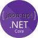

<a href="https://www.jsonapi.net"></a>

# JsonApiDotNetCore

[](https://github.com/json-api-dotnet/JsonApiDotNetCore/actions/workflows/build.yml?query=branch%3Amaster)
[](https://codecov.io/gh/json-api-dotnet/JsonApiDotNetCore)
[](https://www.nuget.org/packages/JsonApiDotNetCore/)
[](LICENSE)
[](https://gitter.im/json-api-dotnet-core/Lobby?utm_source=badge&utm_medium=badge&utm_campaign=pr-badge&utm_content=badge)
[](https://www.firsttimersonly.com/)

A framework for building [JSON:API](https://jsonapi.org/) compliant REST APIs using ASP.NET Core and Entity Framework Core. Includes support for the [Atomic Operations](https://jsonapi.org/ext/atomic/) extension.

The ultimate goal of this library is to eliminate as much boilerplate as possible by offering out-of-the-box features, such as sorting, filtering, pagination, sparse fieldset selection, and side-loading related resources. You just need to focus on defining the resources and implementing your custom business logic. This library has been designed around dependency injection, making extensibility incredibly easy.

> [!NOTE]
> OpenAPI support is now [available](https://www.jsonapi.net/usage/openapi.html), currently in preview. Give it a try!

## Getting started

The following steps describe how to create a JSON:API project.

1. Create a new ASP.NET Core Web API project:

   ```bash
   dotnet new webapi --no-openapi --use-controllers --name ExampleJsonApi
   cd ExampleJsonApi
   ```

1. Install the JsonApiDotNetCore package, along with your preferred Entity Framework Core provider:

   ```bash
   dotnet add package JsonApiDotNetCore
   dotnet add package Microsoft.EntityFrameworkCore.Sqlite
   ```

1. Declare your entities, annotated with JsonApiDotNetCore attributes:

   ```c#
   [Resource]
   public class Person : Identifiable<long>
   {
       [Attr] public string? FirstName { get; set; }
       [Attr] public string LastName { get; set; } = null!;
       [HasMany] public ISet<Person> Children { get; set; } = new HashSet<Person>();
   }
   ```

1. Define your `DbContext`, seeding the database with sample data:

   ```c#
   public class AppDbContext(DbContextOptions<AppDbContext> options) : DbContext(options)
   {
       public DbSet<Person> People => Set<Person>();

       protected override void OnConfiguring(DbContextOptionsBuilder builder)
       {
           builder.UseSqlite("Data Source=SampleDb.db");
           builder.UseAsyncSeeding(async (dbContext, _, cancellationToken) =>
           {
               dbContext.Set<Person>().Add(new Person
               {
                   FirstName = "John",
                   LastName = "Doe",
                   Children =
                   {
                       new Person
                       {
                           FirstName = "Baby",
                           LastName = "Doe"
                       }
                   }
               });
               await dbContext.SaveChangesAsync(cancellationToken);
           });
       }
   }
   ```

1. Configure Entity Framework Core and JsonApiDotNetCore in `Program.cs`:

   ```c#
   var builder = WebApplication.CreateBuilder(args);
   builder.Services.AddDbContext<AppDbContext>();
   builder.Services.AddJsonApi<AppDbContext>(options =>
   {
       options.UseRelativeLinks = true;
       options.IncludeTotalResourceCount = true;
   });

   var app = builder.Build();
   app.UseRouting();
   app.UseJsonApi();
   app.MapControllers();
   await CreateDatabaseAsync(app.Services);
   app.Run();

   static async Task CreateDatabaseAsync(IServiceProvider serviceProvider)
   {
       await using var scope = serviceProvider.CreateAsyncScope();
       var dbContext = scope.ServiceProvider.GetRequiredService<AppDbContext>();
       await dbContext.Database.EnsureDeletedAsync();
       await dbContext.Database.EnsureCreatedAsync();
   }
   ```

1. Start your API

   ```bash
   dotnet run
   ```

1. Send a GET request to retrieve data:

   ```bash
   GET http://localhost:5000/people?filter=equals(firstName,'John')&include=children HTTP/1.1
   ```

   <details>
   <summary>Expand to view the JSON response</summary>

   ```json
   {
     "links": {
       "self": "/people?filter=equals(firstName,%27John%27)&include=children",
       "first": "/people?filter=equals(firstName,%27John%27)&include=children",
       "last": "/people?filter=equals(firstName,%27John%27)&include=children"
     },
     "data": [
       {
         "type": "people",
         "id": "1",
         "attributes": {
           "firstName": "John",
           "lastName": "Doe"
         },
         "relationships": {
           "children": {
             "links": {
               "self": "/people/1/relationships/children",
               "related": "/people/1/children"
             },
             "data": [
               {
                 "type": "people",
                 "id": "2"
               }
             ]
           }
         },
         "links": {
           "self": "/people/1"
         }
       }
     ],
     "included": [
       {
         "type": "people",
         "id": "2",
         "attributes": {
           "firstName": "Baby",
           "lastName": "Doe"
         },
         "relationships": {
           "children": {
             "links": {
               "self": "/people/2/relationships/children",
               "related": "/people/2/children"
             }
           }
         },
         "links": {
           "self": "/people/2"
         }
       }
     ],
     "meta": {
       "total": 1
     }
   }
   ```

</details>

## Learn more

The following links explain what this project provides, why it exists, and how you can use it.

### About

- [What is JSON:API and why should I use it?](https://nordicapis.com/the-benefits-of-using-json-api/) (blog, 2017)
- [Pragmatic JSON:API Design](https://www.youtube.com/watch?v=3jBJOga4e2Y) (video, 2017)
- [JSON:API and JsonApiDotNetCore](https://www.youtube.com/watch?v=79Oq0HOxyeI) (video, 2021)
- [JsonApiDotNetCore Release 4.0](https://dev.to/wunki/getting-started-5dkl) (blog, 2020)
- [JSON:API, ASP.NET Core, EmberJS](https://youtu.be/KAMuo6K7VcE) (video, 2017)
- [Embercasts: Full Stack Ember with ASP.NET Core](https://www.embercasts.com/course/full-stack-ember-with-dotnet/watch/whats-in-this-course-cs) (paid course, 2017)

### Official documentation

- [JsonApiDotNetCore documentation](https://www.jsonapi.net/)
- [The JSON:API specification](https://jsonapi.org/format/)
- [JsonApiDotNetCore roadmap](ROADMAP.md)

### Samples

- The [examples](https://github.com/json-api-dotnet/JsonApiDotNetCore/tree/master/src/Examples) directory provides ready-to-run sample API projects, which are documented [here](https://www.jsonapi.net/request-examples/index.html).
- The [integration tests](https://github.com/json-api-dotnet/JsonApiDotNetCore/tree/master/test/JsonApiDotNetCoreTests/IntegrationTests) directory covers many advanced use cases, which are documented [here](https://www.jsonapi.net/usage/advanced/index.html).
  This includes topics such as batching, multi-tenancy, authorization, soft-deletion, obfuscated IDs, resource inheritance, alternate routing, custom metadata, error handling and logging.
- The [Ember.js Todo List App](https://github.com/json-api-dotnet/TodoListExample) showcases a JsonApiDotNetCore API and an Ember.js client with token authentication.

### Related projects

- [JsonApiDotNetCore.MongoDb](https://github.com/json-api-dotnet/JsonApiDotNetCore.MongoDb)
- [Ember.js Todo List App](https://github.com/json-api-dotnet/TodoListExample)
- [Performance Reports](https://github.com/json-api-dotnet/PerformanceReports)

## Compatibility

The following chart should help you pick the best version, based on your environment.
See also our [versioning policy](./VERSIONING_POLICY.md).

| JsonApiDotNetCore | Status       | .NET     | Entity Framework Core |
| ----------------- | ------------ | -------- | --------------------- |
| master            | Preview      | 9        | 9                     |
|                   |              | 8        | 8, 9                  |
| 5.7.0+            | Stable       | 9        | 9                     |
|                   |              | 8        | 8, 9                  |
| 5.5.0-5.6.0       | Stable       | 9        | 9                     |
|                   |              | 8        | 8, 9                  |
|                   |              | 7        | 7                     |
|                   |              | 6        | 6, 7                  |
| 5.0.3-5.4.0       | Stable       | 7        | 7                     |
|                   |              | 6        | 6, 7                  |
| 5.0.0-5.0.2       | Stable       | 6        | 6                     |
| 4.x               | Stable       | 6        | 5                     |
|                   |              | 5        | 5                     |
|                   |              | Core 3.1 | 3.1, 5                |
| 3.x               | Stable       | Core 2.x | 2.x                   |

## Trying out the latest build

After each commit to the master branch, a new pre-release NuGet package is automatically published to [feedz.io](https://feedz.io/docs/package-types/nuget).
To try it out, follow the steps below:

1. Create a `nuget.config` file in the same directory as your .sln file, with the following contents:
   ```xml
   <?xml version="1.0" encoding="utf-8"?>
   <configuration>
     <packageSources>
       <add key="json-api-dotnet" value="https://f.feedz.io/json-api-dotnet/jsonapidotnetcore/nuget/index.json" />
       <add key="NuGet" value="https://api.nuget.org/v3/index.json" />
     </packageSources>
   </configuration>
   ```

1. In your IDE, browse the list of packages from the `json-api-dotnet` feed. Make sure pre-release packages are included in the list.

## Contributing

Have a question, found a bug or want to submit code changes? See our [contributing guidelines](./.github/CONTRIBUTING.md).

## Build from source

To build the code from this repository locally, run:

```bash
dotnet build
```

Running tests locally requires access to a PostgreSQL database. If you have docker installed, this can be started via:

```bash
pwsh run-docker-postgres.ps1
```

And then to run the tests:

```bash
dotnet test
```

Alternatively, to build, run all tests, generate code coverage and NuGet packages:

```bash
pwsh Build.ps1
```

## Sponsors

We are grateful to the following sponsors, who provide the team with a no-cost license for using their tools.

<p>
  <a href="https://jb.gg/OpenSource">
    <picture>
      <source media="(prefers-color-scheme: dark)" srcset="docs/home/assets/img/jetbrains-logo-dark.svg">
      <source media="(prefers-color-scheme: light)" srcset="docs/home/assets/img/jetbrains-logo-light.svg">
      
    </picture>
  </a>
  &nbsp;&nbsp;&nbsp;
  <a href="https://www.araxis.com">
    
  </a>
<p/>

Do you like this project? Consider to [sponsor](https://github.com/sponsors/json-api-dotnet), or just reward us by giving our repository a star.
