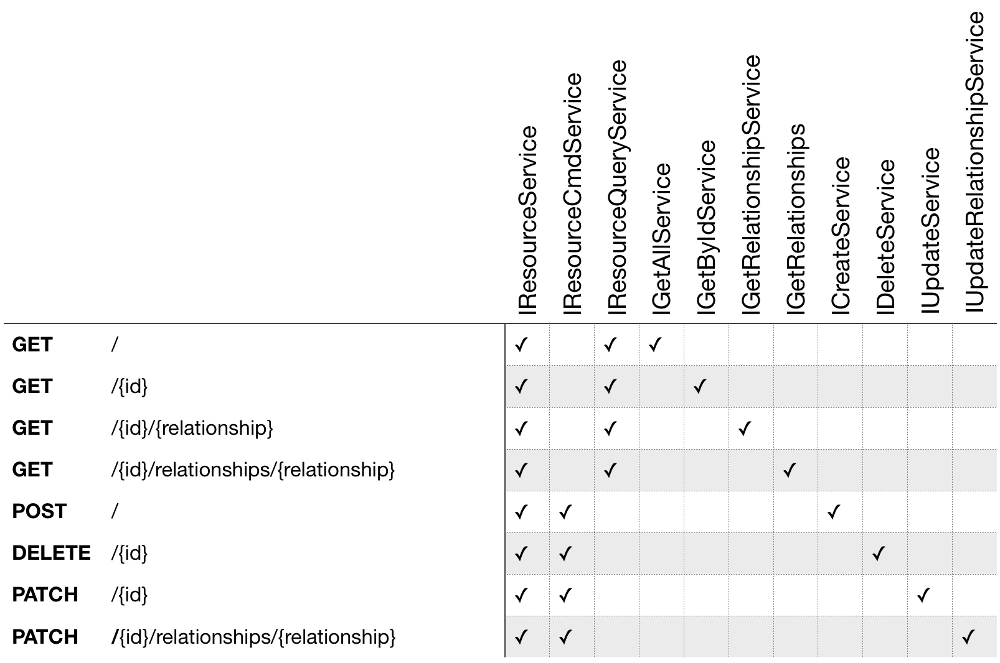

# Resource Services

The [IResourceService](https://github.com/json-api-dotnet/JsonApiDotNetCore/blob/master/src/JsonApiDotNetCore/Services/Contract/IResourceService.cs) acts as a service layer between the controller and the data access
layer. This allows you to customize it however you want and not be dependent upon Entity
Framework. This is also a good place to implement custom business logic.

### Supplementing Default Behavior

A simple example would be to send notifications when an entity gets created:

```csharp
public class TodoItemService : EntityResourceService<TodoItem> {
    
    private readonly INotificationService _notificationService;

    public TodoItemService(
        IJsonApiContext jsonApiContext,
        IEntityRepository<T, TId> repository,
        ILoggerFactory loggerFactory,
        // Get the notification service via DI
        INotificationService notificationService) 
    : base(jsonApiContext, repository, loggerFactory)
    {
        _notificationService = notificationService;
    }

    public override async Task<TEntity> CreateAsync(TEntity entity)
    {
        // call the base implementation which uses Entity Framework
        var newEntity = await base.CreateAsync(entity);
        
        // custom code
        _notificationService.Notify($"Entity created: { newEntity.Id }");

        // don't forget to return the new entity
        return entity;
    }
}
```

### Not Using Entity Framework?

As previously discussed, this library uses Entity Framework by default. 
If you'd like to use another ORM that does not implement `IQueryable`, 
you can inject a custom service like so:

```csharp
// Startup.cs
public void ConfigureServices(IServiceCollection services)
{
    // add the service override for MyModel
    services.AddScoped<IResourceService<MyModel>, MyModelService>();
    
    // add your own DAO
    services.AddScoped<IMyModelDAL, MyModelDAL>();
    // ...
}


// MyModelService.cs
public class MyModelService : IResourceService<MyModel>
{
    private readonly IMyModelDAL _dal;
    public MyModelService(IMyModelDAL dal)
    { 
        _dal = dal;
    } 

    public Task<IEnumerable<MyModel>> GetAsync()
    {
        return await _dal.GetModelAsync();
    }
}
```

### Limited Requirements

In some cases it may be necessary to only expose a few methods on the resource.
For this reason, we have created a hierarchy of service interfaces that can be used to get the
exact implementation you require. Below is a table outlining these interfaces:




 In order to take advantage of these interfaces you first need to inject the service for each implemented interface. 
 Using Autofac, as an example, this is simply:

```csharp
public class MyResourceService : ICreateService<MyResource>, IDeleteService<MyResource> {
   // ...
}
```

```csharp
public class Startup {
  public IServiceProvider ConfigureServices(IServiceCollection services) {
    builder.RegisterType<MyResourceService>().AsImplementedInterfaces();
  }
}
```

Then in the controller, you should inherit the base controller and pass the services into
the named, optional base parameters:

```csharp
public class MyResourcesController : BaseJsonApiController<MyResource> {

    public MyResourcesController(
        IJsonApiContext jsonApiContext, 
        ICreateService<MyResource> create,
        IDeleteService<MyResource> delete
    ) : base(jsonApiContext, create: create, delete: delete) { }

    [HttpPost]
    public override async Task<IActionResult> PostAsync([FromBody] MyResource entity) 
        => await base.PostAsync(entity);

    [HttpDelete("{id}")]
    public override async Task<IActionResult>DeleteAsync(int id) 
        => await base.DeleteAsync(id);
}
```
