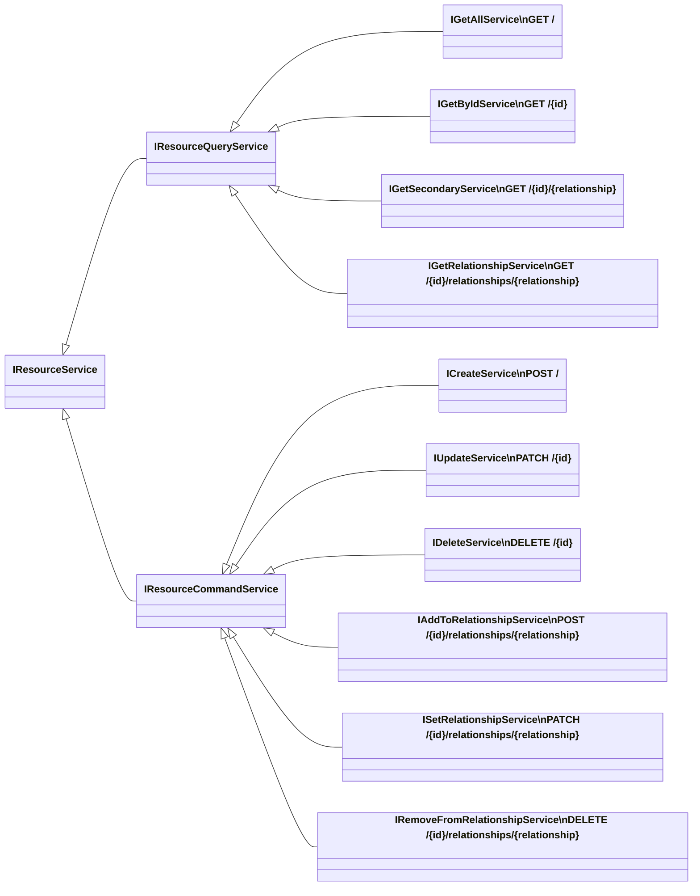

# Resource Services

The `IResourceService` acts as a service layer between the controller and the data access layer.
This allows you to customize it however you want. While this is still a potential place to implement custom business logic,
since v4, [Resource Definitions](~/usage/extensibility/resource-definitions.md) are more suitable for that.

## Supplementing Default Behavior

If you don't need to alter the underlying mechanisms, you can inherit from `JsonApiResourceService<TResource, TId>` and override the existing methods.
In simple cases, you can also just wrap the base implementation with your custom logic.

A simple example would be to send notifications when a resource gets created.

```c#
public class TodoItemService : JsonApiResourceService<TodoItem, long>
{
    private readonly INotificationService _notificationService;

    public TodoItemService(IResourceRepositoryAccessor repositoryAccessor,
        IQueryLayerComposer queryLayerComposer, IPaginationContext paginationContext,
        IJsonApiOptions options, ILoggerFactory loggerFactory, IJsonApiRequest request,
        IResourceChangeTracker<TodoItem> resourceChangeTracker,
        IResourceDefinitionAccessor resourceDefinitionAccessor,
        INotificationService notificationService)
        : base(repositoryAccessor, queryLayerComposer, paginationContext, options,
            loggerFactory, request, resourceChangeTracker, resourceDefinitionAccessor)
    {
        _notificationService = notificationService;
    }

    public override async Task<TodoItem> CreateAsync(TodoItem resource,
        CancellationToken cancellationToken)
    {
        // Call the base implementation
        var newResource = await base.CreateAsync(resource, cancellationToken);

        // Custom code
        await _notificationService.NotifyAsync($"Resource created: {newResource.StringId}");

        return newResource;
    }
}
```

## Not Using Entity Framework Core?

As previously discussed, this library uses Entity Framework Core by default.
If you'd like to use another ORM that does not provide what JsonApiResourceService depends upon, you can use a custom `IResourceService<TResource, TId>` implementation.

```c#
// Program.cs

// Add the service override for Product.
builder.Services.AddScoped<IResourceService<Product, long>, ProductService>();

// Add your own Data Access Object.
builder.Services.AddScoped<IProductDao, ProductDao>();

// ProductService.cs

public class ProductService : IResourceService<Product, long>
{
    private readonly IProductDao _dao;

    public ProductService(IProductDao dao)
    {
        _dao = dao;
    }

    public async Task<IReadOnlyCollection<Product>> GetAsync(
        CancellationToken cancellationToken)
    {
        return await _dao.GetProductsAsync(cancellationToken);
    }
}
```

## Limited Requirements

In some cases it may be necessary to only expose a few actions on a resource. For this reason, we have created a hierarchy of service interfaces that can be used to get the exact implementation you require.

This interface hierarchy is defined by this tree structure.



In order to take advantage of these interfaces you first need to register the service for each implemented interface.

```c#
public class ArticleService : ICreateService<Article, long>, IDeleteService<Article, long>
{
    // ...
}

// Program.cs
builder.Services.AddScoped<ICreateService<Article, long>, ArticleService>();
builder.Services.AddScoped<IDeleteService<Article, long>, ArticleService>();
```

In v3.0 we introduced an extension method that you can use to register a resource service on all of its JsonApiDotNetCore interfaces.
This is helpful when you implement (a subset of) the resource interfaces and want to register them all in one go.

```c#
// Program.cs
builder.Services.AddResourceService<ArticleService>();
```

> [!TIP]
> If you're using [auto-discovery](~/usage/resource-graph.md#auto-discovery), then resource services, repositories and resource definitions will be automatically registered for you.

Then on your model, pass in the set of endpoints to expose (the ones that you've registered services for):

```c#
[Resource(GenerateControllerEndpoints =
    JsonApiEndpoints.Create | JsonApiEndpoints.Delete)]
public class Article : Identifiable<long>
{
    // ...
}
```

Alternatively, when using a hand-written controller, you should inherit from the JSON:API controller and pass the services into the named, optional base parameters:

```c#
public class ArticlesController : JsonApiController<Article, long>
{
    public ArticlesController(IJsonApiOptions options, IResourceGraph resourceGraph,
        ILoggerFactory loggerFactory, ICreateService<Article, long> create,
        IDeleteService<Article, long> delete)
        : base(options, resourceGraph, loggerFactory, create: create, delete: delete)
    {
    }
}
```
